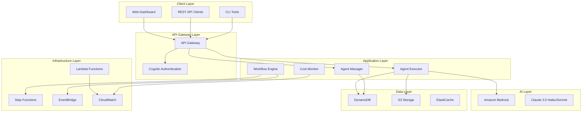

# Design Document

## Overview

AgentHub is designed as a serverless, AWS-native platform that provides universal AI agent hosting and execution capabilities. The architecture follows cloud-native principles with microservices patterns, event-driven communication, and auto-scaling infrastructure. The platform enables organizations to deploy, manage, and orchestrate AI agents across all business functions through a unified interface.

## Architecture

### High-Level Architecture



### Service Architecture by Epic

#### EPIC 1: Core Platform Infrastructure
- **Agent Executor Service**: Lambda-based runtime for agent execution
- **Data Storage Service**: S3 for artifacts, DynamoDB for metadata
- **Authentication Service**: Cognito for user management
- **Logging Service**: CloudWatch for centralized logging

#### EPIC 2: Agent Catalog & Management
- **Agent Registry Service**: DynamoDB-based catalog with search capabilities
- **Agent Validation Service**: Code analysis and schema validation
- **Metadata Management Service**: Agent versioning and lifecycle management

#### EPIC 3: Pre-built Agent Library
- **QE Agent Service**: Test case generation using Bedrock
- **DevOps Agent Service**: Infrastructure analysis and monitoring
- **Security Agent Service**: Vulnerability scanning and compliance
- **Business Agent Service**: Data analysis and reporting

## Components and Interfaces

### Core Components

#### 1. Agent Executor (Lambda Function)
```python
class AgentExecutor:
    def __init__(self):
        self.bedrock_client = boto3.client('bedrock-runtime')
        self.s3_client = boto3.client('s3')
        self.dynamodb = boto3.resource('dynamodb')
    
    def execute_agent(self, agent_id: str, input_data: dict) -> dict:
        # Load agent configuration
        # Initialize AI model
        # Execute agent logic
        # Store results
        # Return execution summary
```

**Interfaces:**
- Input: `POST /agents/{agent_id}/execute`
- Output: Execution results with metadata
- Dependencies: Bedrock, S3, DynamoDB

#### 2. Agent Registry (DynamoDB + Lambda)
```python
class AgentRegistry:
    def register_agent(self, agent_config: dict) -> str:
        # Validate agent configuration
        # Store in DynamoDB
        # Return agent ID
    
    def search_agents(self, filters: dict) -> list:
        # Query DynamoDB with filters
        # Return matching agents
```

**Schema:**
```json
{
  "agent_id": "string",
  "name": "string",
  "description": "string",
  "category": "QE|DevOps|Security|Business|Custom",
  "input_schema": "object",
  "output_schema": "object",
  "runtime_config": "object",
  "created_at": "timestamp",
  "updated_at": "timestamp",
  "usage_count": "number",
  "average_rating": "number"
}
```

#### 3. Web Dashboard (React + S3 Static Hosting)
```javascript
// Key Components
- AgentCatalog: Browse and search agents
- AgentExecutor: Configure and run agents
- ResultsViewer: Display execution results
- CostDashboard: Monitor usage and costs
- WorkflowBuilder: Create agent workflows
```

**API Integration:**
- Authentication via Cognito
- Real-time updates via WebSocket
- File uploads to S3 with presigned URLs

### Interface Specifications

#### REST API Endpoints
```yaml
# Agent Management
GET    /agents                    # List all agents
GET    /agents/{id}              # Get agent details
POST   /agents                   # Register new agent
PUT    /agents/{id}              # Update agent
DELETE /agents/{id}              # Delete agent

# Agent Execution
POST   /agents/{id}/execute      # Execute agent
GET    /executions/{id}          # Get execution status
GET    /executions/{id}/results  # Get execution results
DELETE /executions/{id}          # Cancel execution

# User Management
GET    /users/profile            # Get user profile
PUT    /users/profile            # Update profile
GET    /users/usage              # Get usage statistics

# Cost Management
GET    /costs/summary            # Get cost summary
GET    /costs/detailed           # Get detailed costs
POST   /costs/alerts             # Set cost alerts
```

#### Event-Driven Communication
```yaml
# EventBridge Events
agent.execution.started:
  source: "agent-executor"
  detail: { agent_id, execution_id, user_id }

agent.execution.completed:
  source: "agent-executor" 
  detail: { agent_id, execution_id, status, results_s3_key }

agent.execution.failed:
  source: "agent-executor"
  detail: { agent_id, execution_id, error_message }

cost.threshold.exceeded:
  source: "cost-monitor"
  detail: { user_id, current_cost, threshold }
```

## Data Models

### Primary Data Entities

#### Agent Configuration
```json
{
  "agent_id": "qe-test-generator-v1",
  "name": "QE Test Case Generator",
  "description": "Generates comprehensive test cases from requirements",
  "category": "QE",
  "version": "1.0.0",
  "runtime_config": {
    "model_id": "anthropic.claude-3-5-haiku-20241022-v1:0",
    "timeout_seconds": 300,
    "memory_mb": 1024
  },
  "input_schema": {
    "type": "object",
    "properties": {
      "requirements": {"type": "string"},
      "test_type": {"type": "string", "enum": ["unit", "integration", "e2e"]}
    },
    "required": ["requirements"]
  },
  "output_schema": {
    "type": "object",
    "properties": {
      "test_cases": {"type": "array"},
      "coverage_analysis": {"type": "object"}
    }
  }
}
```

#### Execution Record
```json
{
  "execution_id": "exec-123456789",
  "agent_id": "qe-test-generator-v1",
  "user_id": "user-abc123",
  "status": "completed|running|failed|cancelled",
  "input_data": "object",
  "results_s3_key": "results/exec-123456789/output.json",
  "execution_time_ms": 45000,
  "cost_usd": 0.15,
  "created_at": "2024-01-15T10:30:00Z",
  "completed_at": "2024-01-15T10:30:45Z",
  "error_message": "string|null"
}
```

#### User Profile
```json
{
  "user_id": "user-abc123",
  "email": "user@company.com",
  "name": "John Doe",
  "role": "QE Engineer",
  "organization": "Acme Corp",
  "cost_limit_usd": 100.00,
  "current_month_cost": 25.50,
  "permissions": ["execute_agents", "upload_custom_agents"],
  "created_at": "2024-01-01T00:00:00Z"
}
```

### Database Design

#### DynamoDB Tables

**AgentRegistry Table:**
- Partition Key: `agent_id`
- Sort Key: `version`
- GSI1: `category` (PK) + `created_at` (SK)
- GSI2: `usage_count` (PK) + `average_rating` (SK)

**ExecutionHistory Table:**
- Partition Key: `user_id`
- Sort Key: `execution_id`
- GSI1: `agent_id` (PK) + `created_at` (SK)
- GSI2: `status` (PK) + `created_at` (SK)

**UserProfiles Table:**
- Partition Key: `user_id`
- Attributes: Profile data, preferences, cost limits

#### S3 Bucket Structure
```
agent-hub-storage/
├── agents/
│   ├── {agent_id}/
│   │   ├── code.zip
│   │   ├── config.json
│   │   └── documentation.md
├── executions/
│   ├── {execution_id}/
│   │   ├── input.json
│   │   ├── output.json
│   │   └── logs.txt
└── templates/
    ├── agent-templates/
    └── workflow-templates/
```

## Error Handling

### Error Classification
1. **User Errors** (4xx): Invalid input, authentication failures
2. **System Errors** (5xx): Service unavailable, timeout errors
3. **Agent Errors**: Agent-specific execution failures
4. **Cost Errors**: Budget exceeded, payment failures

### Error Response Format
```json
{
  "error": {
    "code": "AGENT_EXECUTION_FAILED",
    "message": "Agent execution failed due to invalid input format",
    "details": {
      "agent_id": "qe-test-generator-v1",
      "execution_id": "exec-123456789",
      "validation_errors": ["requirements field is required"]
    },
    "timestamp": "2024-01-15T10:30:00Z",
    "request_id": "req-abc123"
  }
}
```

### Retry Strategy
- **Transient Failures**: Exponential backoff (1s, 2s, 4s, 8s)
- **Rate Limiting**: Jittered retry with circuit breaker
- **Cost Limits**: Immediate failure with user notification
- **Agent Timeouts**: Configurable per agent type

## Testing Strategy

### Testing Pyramid

#### Unit Tests (70%)
- Individual Lambda functions
- Data model validation
- Business logic components
- Utility functions

#### Integration Tests (20%)
- API endpoint testing
- Database operations
- S3 file operations
- Bedrock API integration

#### End-to-End Tests (10%)
- Complete user workflows
- Multi-agent orchestration
- Cost monitoring accuracy
- Performance benchmarks

### Test Implementation

#### Lambda Function Testing
```python
import pytest
from moto import mock_dynamodb, mock_s3
from agent_executor import AgentExecutor

@mock_dynamodb
@mock_s3
def test_agent_execution():
    # Setup mock AWS resources
    # Create test agent configuration
    # Execute agent with test input
    # Verify results and side effects
```

#### API Testing
```python
import requests
import pytest

def test_agent_execution_api():
    response = requests.post(
        f"{API_BASE_URL}/agents/qe-test-generator-v1/execute",
        headers={"Authorization": f"Bearer {auth_token}"},
        json={"requirements": "Test user login functionality"}
    )
    assert response.status_code == 200
    assert "execution_id" in response.json()
```

### Performance Testing
- **Load Testing**: 100 concurrent agent executions
- **Stress Testing**: Peak load scenarios
- **Cost Testing**: Verify cost calculations accuracy
- **Latency Testing**: Sub-2-second response times for API calls

### Security Testing
- **Authentication Testing**: Token validation, session management
- **Authorization Testing**: Role-based access controls
- **Input Validation**: SQL injection, XSS prevention
- **Data Encryption**: At-rest and in-transit encryption verification

This design provides a scalable, maintainable foundation for the AgentHub platform while supporting the incremental development approach outlined in the EPICs structure.