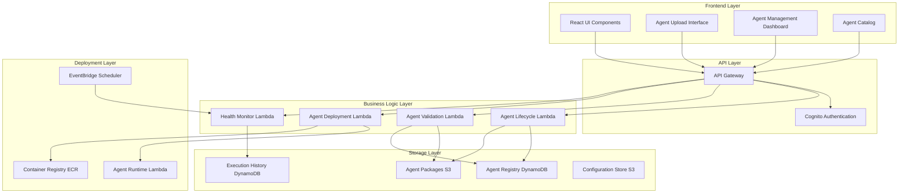

# Design Document

## Overview

The Agent Lifecycle Management system provides a comprehensive platform for managing AI agents throughout their entire lifecycle on AgentHub. The system is built on AWS serverless architecture and integrates with the existing AgentHub infrastructure to provide seamless agent onboarding, validation, deployment, monitoring, and management capabilities.

The design leverages the existing AWS CDK infrastructure including DynamoDB tables, S3 storage, Lambda functions, and API Gateway, while extending it with new components specifically for lifecycle management. The system supports multiple agent types (QE, DevOps, Security, Business, Market Data, Custom) and provides both automated and manual workflows for agent management.

## Architecture

### High-Level Architecture



### Component Architecture

The system follows a microservices architecture with the following key components:

1. **Agent Lifecycle Manager**: Central orchestrator for all lifecycle operations
2. **Validation Engine**: Automated security and quality validation
3. **Deployment Engine**: Handles agent deployment to various runtime environments
4. **Health Monitor**: Continuous monitoring and alerting system
5. **Configuration Manager**: Manages agent configurations and metadata
6. **Runtime Manager**: Manages agent execution environments

## Components and Interfaces

### 1. Agent Lifecycle Manager

**Purpose**: Central component that orchestrates all agent lifecycle operations including registration, validation, deployment, and decommissioning.

**Key Interfaces**:
- `POST /agents` - Register new agent
- `PUT /agents/{id}/status` - Update agent status
- `GET /agents/{id}/lifecycle` - Get lifecycle status
- `DELETE /agents/{id}` - Decommission agent

**Implementation**:
```python
class AgentLifecycleManager:
    def register_agent(self, agent_metadata: AgentMetadata) -> RegistrationResult
    def validate_agent(self, agent_id: str) -> ValidationResult
    def deploy_agent(self, agent_id: str, deployment_config: DeploymentConfig) -> DeploymentResult
    def monitor_agent(self, agent_id: str) -> HealthStatus
    def update_agent(self, agent_id: str, update_config: UpdateConfig) -> UpdateResult
    def decommission_agent(self, agent_id: str) -> DecommissionResult
```

### 2. Agent Validation Engine

**Purpose**: Automated validation of agent packages including security scanning, dependency checking, and compliance verification.

**Key Features**:
- Package structure validation
- Security vulnerability scanning
- Dependency conflict detection
- Code quality analysis
- Compliance checking (OWASP, security policies)

**Implementation**:
```python
class AgentValidator:
    def validate_package_structure(self, package_path: str) -> ValidationResult
    def scan_security_vulnerabilities(self, package_path: str) -> SecurityScanResult
    def check_dependencies(self, requirements: List[str]) -> DependencyCheckResult
    def analyze_code_quality(self, code_files: List[str]) -> QualityAnalysisResult
    def verify_compliance(self, agent_metadata: AgentMetadata) -> ComplianceResult
```

### 3. Agent Deployment Engine

**Purpose**: Handles deployment of validated agents to various runtime environments including Lambda, containers, and custom runtimes.

**Deployment Strategies**:
- **Lambda Deployment**: For lightweight agents
- **Container Deployment**: For complex agents with custom dependencies
- **Hybrid Deployment**: For agents requiring multiple runtime environments

**Implementation**:
```python
class AgentDeploymentEngine:
    def deploy_to_lambda(self, agent_id: str, package: AgentPackage) -> LambdaDeploymentResult
    def deploy_to_container(self, agent_id: str, container_config: ContainerConfig) -> ContainerDeploymentResult
    def create_api_endpoint(self, agent_id: str, endpoint_config: EndpointConfig) -> EndpointResult
    def setup_monitoring(self, agent_id: str, monitoring_config: MonitoringConfig) -> MonitoringSetupResult
    def configure_scaling(self, agent_id: str, scaling_config: ScalingConfig) -> ScalingResult
```

### 4. Health Monitoring System

**Purpose**: Continuous monitoring of deployed agents including health checks, performance metrics, and alerting.

**Monitoring Capabilities**:
- Real-time health status
- Performance metrics collection
- Error rate tracking
- Resource utilization monitoring
- Automated alerting and recovery

**Implementation**:
```python
class HealthMonitor:
    def perform_health_check(self, agent_id: str) -> HealthCheckResult
    def collect_metrics(self, agent_id: str, time_range: TimeRange) -> MetricsCollection
    def analyze_performance(self, agent_id: str) -> PerformanceAnalysis
    def trigger_alerts(self, agent_id: str, alert_conditions: List[AlertCondition]) -> AlertResult
    def attempt_recovery(self, agent_id: str, recovery_strategy: RecoveryStrategy) -> RecoveryResult
```

### 5. Configuration Management

**Purpose**: Manages agent configurations, versions, and metadata throughout the lifecycle.

**Configuration Types**:
- Agent metadata and descriptions
- Runtime configurations
- Deployment parameters
- Monitoring settings
- Access control policies

**Implementation**:
```python
class ConfigurationManager:
    def store_agent_config(self, agent_id: str, config: AgentConfiguration) -> ConfigResult
    def retrieve_agent_config(self, agent_id: str, version: str = None) -> AgentConfiguration
    def update_config(self, agent_id: str, config_updates: ConfigUpdates) -> UpdateResult
    def manage_versions(self, agent_id: str) -> VersionManagementResult
    def validate_config(self, config: AgentConfiguration) -> ValidationResult
```

## Data Models

### Agent Registry Schema

```python
@dataclass
class AgentRegistryEntry:
    agent_id: str
    name: str
    description: str
    category: AgentCategory
    version: str
    author: str
    status: AgentStatus
    created_at: datetime
    updated_at: datetime
    
    # Lifecycle information
    lifecycle: AgentLifecycle
    
    # Metadata
    metadata: AgentMetadata
    
    # Configuration
    configuration: AgentConfiguration
    
    # Metrics
    metrics: AgentMetrics

@dataclass
class AgentLifecycle:
    deployment_status: DeploymentStatus
    health_status: HealthStatus
    last_health_check: datetime
    deployment_history: List[DeploymentRecord]
    validation_history: List[ValidationRecord]
    
@dataclass
class AgentMetadata:
    input_schema: Dict[str, Any]
    output_schema: Dict[str, Any]
    frameworks: List[str]
    dependencies: List[str]
    tags: List[str]
    documentation_url: Optional[str]
    
@dataclass
class AgentConfiguration:
    runtime_config: RuntimeConfig
    deployment_config: DeploymentConfig
    monitoring_config: MonitoringConfig
    scaling_config: ScalingConfig
    security_config: SecurityConfig
```

### Execution History Schema

```python
@dataclass
class ExecutionRecord:
    execution_id: str
    agent_id: str
    user_id: str
    status: ExecutionStatus
    start_time: datetime
    end_time: Optional[datetime]
    execution_time_ms: Optional[int]
    input_data: Dict[str, Any]
    output_data: Optional[Dict[str, Any]]
    error_message: Optional[str]
    metrics: ExecutionMetrics
```

### Health Monitoring Schema

```python
@dataclass
class HealthStatus:
    agent_id: str
    status: HealthStatusType
    last_check: datetime
    response_time_ms: float
    error_rate: float
    availability_percentage: float
    resource_utilization: ResourceUtilization
    
@dataclass
class ResourceUtilization:
    cpu_usage: float
    memory_usage: float
    network_io: float
    storage_usage: float
```

## Error Handling

### Error Categories

1. **Validation Errors**: Package structure, security, dependencies
2. **Deployment Errors**: Infrastructure, configuration, resource limits
3. **Runtime Errors**: Execution failures, timeouts, resource exhaustion
4. **System Errors**: Infrastructure failures, service unavailability

### Error Handling Strategy

```python
class ErrorHandler:
    def handle_validation_error(self, error: ValidationError) -> ErrorResponse
    def handle_deployment_error(self, error: DeploymentError) -> ErrorResponse
    def handle_runtime_error(self, error: RuntimeError) -> ErrorResponse
    def handle_system_error(self, error: SystemError) -> ErrorResponse
    
    def retry_with_backoff(self, operation: Callable, max_retries: int = 3) -> Any
    def circuit_breaker(self, service: str, operation: Callable) -> Any
    def graceful_degradation(self, primary_service: str, fallback_service: str) -> Any
```

### Recovery Mechanisms

1. **Automatic Retry**: For transient failures
2. **Circuit Breaker**: For service protection
3. **Graceful Degradation**: Fallback to reduced functionality
4. **Manual Intervention**: For complex issues requiring human oversight

## Testing Strategy

### Unit Testing

- **Component Testing**: Individual component functionality
- **Integration Testing**: Component interaction testing
- **Mock Testing**: External service dependencies

### System Testing

- **End-to-End Testing**: Complete lifecycle workflows
- **Load Testing**: Performance under various loads
- **Chaos Testing**: Resilience under failure conditions

### Security Testing

- **Vulnerability Scanning**: Automated security analysis
- **Penetration Testing**: Manual security assessment
- **Compliance Testing**: Regulatory requirement validation

### Testing Implementation

```python
class AgentLifecycleTests:
    def test_agent_registration(self)
    def test_package_validation(self)
    def test_deployment_process(self)
    def test_health_monitoring(self)
    def test_error_handling(self)
    def test_performance_metrics(self)
    def test_security_compliance(self)
    
class IntegrationTests:
    def test_complete_lifecycle(self)
    def test_multi_agent_deployment(self)
    def test_system_resilience(self)
    def test_scaling_behavior(self)
```

### Performance Testing

- **Throughput Testing**: Agent execution capacity
- **Latency Testing**: Response time optimization
- **Scalability Testing**: System behavior under load
- **Resource Testing**: Memory and CPU utilization

## Security Considerations

### Authentication and Authorization

- **User Authentication**: Cognito-based user management
- **Role-Based Access Control**: Different permissions for different user types
- **API Security**: JWT tokens and API key management
- **Agent Isolation**: Secure execution environments

### Data Security

- **Encryption at Rest**: S3 and DynamoDB encryption
- **Encryption in Transit**: HTTPS/TLS for all communications
- **Data Privacy**: PII handling and GDPR compliance
- **Audit Logging**: Comprehensive activity logging

### Agent Security

- **Package Scanning**: Automated vulnerability detection
- **Sandboxed Execution**: Isolated runtime environments
- **Resource Limits**: CPU, memory, and network restrictions
- **Code Analysis**: Static and dynamic analysis

### Infrastructure Security

- **Network Security**: VPC, security groups, NACLs
- **IAM Policies**: Least privilege access
- **Monitoring**: CloudTrail, CloudWatch, GuardDuty
- **Compliance**: SOC2, ISO 27001 alignment

## Scalability and Performance

### Horizontal Scaling

- **Lambda Concurrency**: Automatic scaling for agent execution
- **API Gateway**: Built-in scaling and throttling
- **DynamoDB**: On-demand scaling for data storage
- **S3**: Unlimited storage capacity

### Performance Optimization

- **Caching Strategy**: Redis/ElastiCache for frequently accessed data
- **CDN Integration**: CloudFront for static content delivery
- **Database Optimization**: Proper indexing and query optimization
- **Connection Pooling**: Efficient database connections

### Monitoring and Metrics

- **Real-time Metrics**: CloudWatch dashboards
- **Performance Alerts**: Automated threshold monitoring
- **Capacity Planning**: Predictive scaling based on usage patterns
- **Cost Optimization**: Resource usage tracking and optimization

## Integration Points

### External Systems

- **GitHub Integration**: Repository-based agent deployment
- **Docker Registry**: Container image management
- **CI/CD Pipelines**: Automated deployment workflows
- **Monitoring Tools**: Integration with existing monitoring systems

### Internal Systems

- **Agent Catalog**: Seamless integration with existing catalog
- **User Management**: Cognito user pool integration
- **Execution Engine**: Integration with current execution system
- **Billing System**: Usage tracking and cost allocation

### API Integrations

- **REST APIs**: Standard HTTP-based interfaces
- **WebSocket APIs**: Real-time communication
- **GraphQL APIs**: Flexible data querying
- **Webhook Support**: Event-driven integrations

## Deployment Strategy

### Infrastructure as Code

- **AWS CDK**: TypeScript-based infrastructure definition
- **Environment Management**: Dev, staging, production environments
- **Resource Tagging**: Consistent resource organization
- **Cost Management**: Resource optimization and monitoring

### Deployment Pipeline

1. **Code Commit**: Developer commits changes
2. **Automated Testing**: Unit and integration tests
3. **Security Scanning**: Vulnerability and compliance checks
4. **Staging Deployment**: Deploy to staging environment
5. **Integration Testing**: End-to-end testing in staging
6. **Production Deployment**: Blue-green deployment to production
7. **Monitoring**: Post-deployment health checks

### Rollback Strategy

- **Blue-Green Deployment**: Zero-downtime deployments
- **Canary Releases**: Gradual rollout with monitoring
- **Automated Rollback**: Trigger rollback on failure detection
- **Manual Rollback**: Emergency rollback procedures