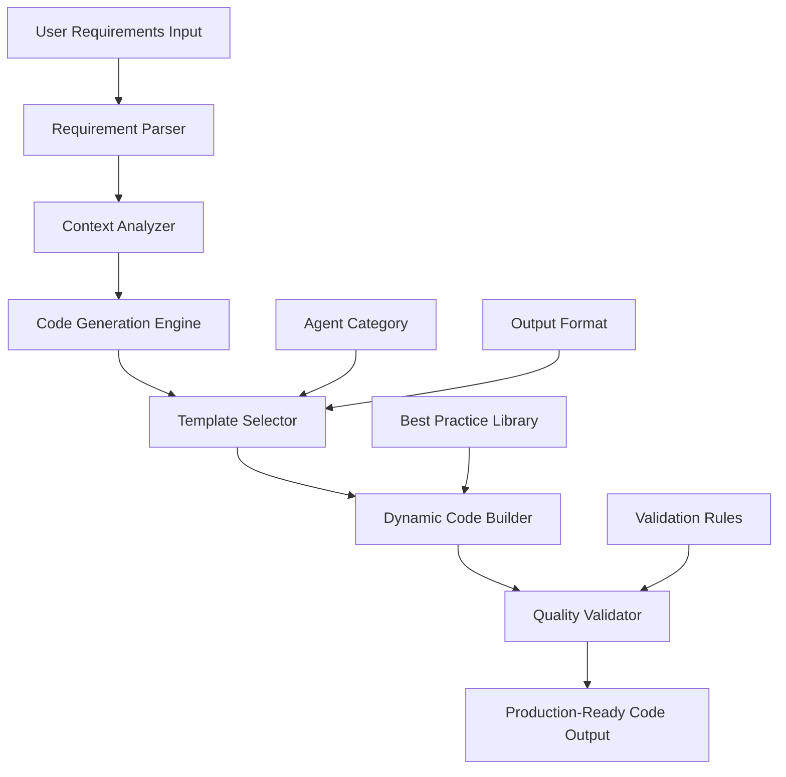
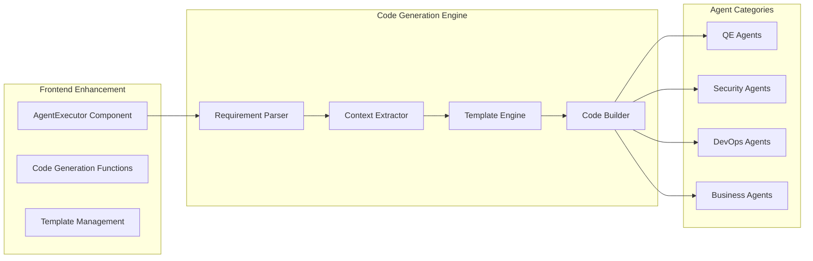

# Design Document

## Overview

The Agent Production Code Enhancement transforms the Agent Hub platform from a template generator into a sophisticated code generation system that produces fully functional, production-ready implementations. The design leverages intelligent requirement parsing, contextual code generation, and best-practice templates to deliver executable solutions across QE testing, security scanning, DevOps automation, and business intelligence domains.

## Architecture

### High-Level Architecture



### Component Architecture



## Components and Interfaces

### 1. Requirement Parser Component

**Purpose:** Analyzes user input to extract technical specifications and context

**Key Functions:**
- `parseRequirements(input: string): ParsedRequirements`
- `extractUrls(input: string): string[]`
- `identifyTechnologies(input: string): Technology[]`
- `detectWorkflows(input: string): Workflow[]`

**Interface:**
```typescript
interface ParsedRequirements {
  baseUrl?: string;
  testScenarios: string[];
  technologies: Technology[];
  selectors: SelectorMap;
  workflows: Workflow[];
  domain: string;
}

interface Technology {
  name: string;
  version?: string;
  framework?: string;
}

interface SelectorMap {
  [key: string]: string;
}
```

### 2. Context Analyzer Component

**Purpose:** Determines the most appropriate code generation strategy based on parsed requirements

**Key Functions:**
- `analyzeContext(requirements: ParsedRequirements): GenerationContext`
- `selectTemplateStrategy(context: GenerationContext): TemplateStrategy`
- `determineBestPractices(context: GenerationContext): BestPractice[]`

**Interface:**
```typescript
interface GenerationContext {
  agentType: AgentType;
  outputFormat: OutputFormat;
  complexity: ComplexityLevel;
  requiredFeatures: Feature[];
  bestPractices: BestPractice[];
}

enum ComplexityLevel {
  BASIC = 'basic',
  INTERMEDIATE = 'intermediate',
  ADVANCED = 'advanced'
}
```

### 3. Code Generation Engine

**Purpose:** Orchestrates the code generation process and manages different agent types

**Key Functions:**
- `generateCode(context: GenerationContext): GeneratedCode`
- `validateCode(code: GeneratedCode): ValidationResult`
- `optimizeCode(code: GeneratedCode): GeneratedCode`

**Interface:**
```typescript
interface GeneratedCode {
  mainCode: string;
  configFiles: ConfigFile[];
  dependencies: Dependency[];
  documentation: string;
  runInstructions: string[];
}

interface ConfigFile {
  filename: string;
  content: string;
  type: 'json' | 'yaml' | 'ini' | 'js' | 'py';
}
```

### 4. Agent-Specific Generators

#### QE Test Generator
- **Cypress Generator:** Produces complete Cypress test suites with Page Object Model
- **Selenium Generator:** Creates Python test classes with WebDriver management
- **Playwright Generator:** Generates TypeScript test suites with fixtures

#### Security Scanner Generator
- **Vulnerability Scanner:** Creates executable security scanning scripts
- **Compliance Checker:** Generates audit scripts with reporting
- **Code Analysis:** Produces static analysis configurations

#### DevOps Automation Generator
- **Infrastructure Monitor:** Creates monitoring scripts with alerting
- **CI/CD Pipeline:** Generates pipeline configurations
- **Infrastructure-as-Code:** Produces Terraform/CloudFormation templates

#### Business Intelligence Generator
- **Data Analysis:** Creates Python/R analysis scripts
- **Dashboard Generator:** Produces visualization code
- **Report Builder:** Generates automated reporting solutions

## Data Models

### Agent Configuration Model

```typescript
interface AgentConfig {
  id: string;
  name: string;
  category: AgentCategory;
  functionalityLevel: FunctionalityLevel;
  supportedFormats: OutputFormat[];
  codeGenerators: CodeGenerator[];
  templates: Template[];
}

enum FunctionalityLevel {
  FULLY_FUNCTIONAL = 'fully_functional',
  PARTIALLY_FUNCTIONAL = 'partially_functional',
  TEMPLATE_BASED = 'template_based'
}

interface CodeGenerator {
  format: OutputFormat;
  generator: GeneratorFunction;
  validator: ValidatorFunction;
}
```

### Template System Model

```typescript
interface Template {
  id: string;
  name: string;
  category: string;
  baseTemplate: string;
  dynamicSections: DynamicSection[];
  requiredContext: string[];
}

interface DynamicSection {
  placeholder: string;
  generator: (context: any) => string;
  conditions?: Condition[];
}
```

## Error Handling

### Code Generation Errors

1. **Requirement Parsing Failures**
   - Fallback to generic templates with clear documentation
   - Provide suggestions for improving requirement clarity
   - Log parsing issues for continuous improvement

2. **Code Generation Failures**
   - Implement graceful degradation to simpler templates
   - Provide partial results with clear limitations
   - Include troubleshooting guides in output

3. **Validation Failures**
   - Return code with validation warnings
   - Provide specific fix recommendations
   - Include links to relevant documentation

### Error Response Format

```typescript
interface GenerationError {
  code: string;
  message: string;
  suggestions: string[];
  fallbackAvailable: boolean;
  partialResult?: GeneratedCode;
}
```

## Testing Strategy

### Unit Testing

1. **Requirement Parser Tests**
   - Test URL extraction from various input formats
   - Validate technology detection accuracy
   - Verify workflow identification logic

2. **Code Generator Tests**
   - Test each agent category's code generation
   - Validate generated code syntax and structure
   - Verify configuration file completeness

3. **Template Engine Tests**
   - Test dynamic section replacement
   - Validate conditional logic execution
   - Verify template inheritance and composition

### Integration Testing

1. **End-to-End Code Generation**
   - Test complete requirement-to-code workflows
   - Validate generated code executability
   - Verify cross-agent consistency

2. **Agent Category Testing**
   - Test each agent type with various inputs
   - Validate output format consistency
   - Verify best practice implementation

### Performance Testing

1. **Code Generation Speed**
   - Measure generation time for different complexity levels
   - Test concurrent generation requests
   - Validate memory usage during generation

2. **Template Processing**
   - Test template loading and caching performance
   - Measure dynamic section processing speed
   - Validate template compilation efficiency

## Implementation Phases

### Phase 1: Core Infrastructure (Requirements 1, 6, 9)
- Implement requirement parser and context analyzer
- Create base code generation engine
- Establish agent categorization system

### Phase 2: QE Agent Enhancement (Requirement 2)
- Upgrade Cypress, Selenium, and Playwright generators
- Implement production-ready test suite generation
- Add comprehensive error handling and logging

### Phase 3: Security Agent Enhancement (Requirement 3)
- Create executable security scanning scripts
- Implement vulnerability assessment tools
- Add compliance checking capabilities

### Phase 4: DevOps Agent Enhancement (Requirement 4)
- Generate infrastructure-as-code templates
- Create monitoring and alerting scripts
- Implement CI/CD pipeline generation

### Phase 5: Business Intelligence Enhancement (Requirement 5)
- Create data analysis and visualization scripts
- Implement automated reporting solutions
- Add predictive analytics capabilities

### Phase 6: Quality and Validation (Requirements 7, 8, 10)
- Implement comprehensive code validation
- Add multi-format output support
- Create testing and quality assurance framework

## Security Considerations

### Code Generation Security

1. **Input Validation**
   - Sanitize all user inputs before processing
   - Validate URLs and prevent injection attacks
   - Implement rate limiting for generation requests

2. **Generated Code Security**
   - Scan generated code for security vulnerabilities
   - Implement secure coding practices in templates
   - Provide security best practice documentation

3. **Template Security**
   - Validate all template modifications
   - Implement template sandboxing
   - Audit template changes and access

### Data Protection

1. **User Requirements**
   - Encrypt sensitive requirement data
   - Implement proper access controls
   - Provide data retention policies

2. **Generated Code**
   - Secure storage of generated artifacts
   - Implement proper cleanup procedures
   - Provide secure sharing mechanisms

## Monitoring and Observability

### Generation Metrics

1. **Usage Analytics**
   - Track agent usage by category and format
   - Monitor generation success rates
   - Measure user satisfaction scores

2. **Performance Metrics**
   - Monitor generation response times
   - Track resource utilization
   - Measure template processing efficiency

3. **Quality Metrics**
   - Track code validation success rates
   - Monitor user feedback on generated code
   - Measure manual customization requirements

### Alerting and Monitoring

1. **Generation Failures**
   - Alert on high failure rates
   - Monitor error patterns and trends
   - Track template performance issues

2. **Performance Degradation**
   - Alert on slow generation times
   - Monitor resource exhaustion
   - Track concurrent request handling

## Scalability Considerations

### Horizontal Scaling

1. **Code Generation Workers**
   - Implement distributed generation processing
   - Use message queues for request handling
   - Support auto-scaling based on demand

2. **Template Caching**
   - Implement distributed template caching
   - Use CDN for template distribution
   - Support cache invalidation strategies

### Vertical Scaling

1. **Memory Optimization**
   - Optimize template loading and processing
   - Implement efficient code generation algorithms
   - Use streaming for large code outputs

2. **CPU Optimization**
   - Optimize requirement parsing algorithms
   - Implement efficient template compilation
   - Use parallel processing where appropriate