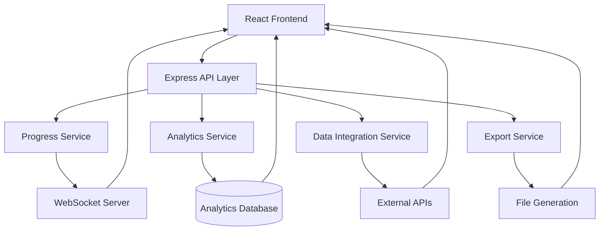

# Design Document

## Overview

This design outlines the implementation of four key enhancements to make the Agent Hub platform look professional and realistic: real-time execution progress, professional dashboard analytics, realistic data integration, and advanced results reporting. The design focuses on creating a seamless user experience that demonstrates enterprise-level capabilities while maintaining the existing architecture.

## Architecture

### High-Level Architecture



### Component Architecture

1. **Progress Management System**
   - WebSocket connection for real-time updates
   - Progress state management with Redux
   - Streaming result components

2. **Analytics Dashboard**
   - Chart.js/D3.js for visualizations
   - Real-time metrics aggregation
   - Responsive dashboard layout

3. **Data Integration Layer**
   - API client abstraction
   - File processing utilities
   - Error handling and retry logic

4. **Export and Reporting System**
   - Template-based report generation
   - Multiple format support
   - Syntax highlighting engine

## Components and Interfaces

### 1. Real-time Execution Progress

#### Progress Service Interface
```typescript
interface ProgressService {
  startExecution(executionId: string, steps: ExecutionStep[]): void;
  updateProgress(executionId: string, stepId: string, status: StepStatus): void;
  streamResult(executionId: string, data: StreamData): void;
  completeExecution(executionId: string, result: ExecutionResult): void;
}

interface ExecutionStep {
  id: string;
  name: string;
  description: string;
  estimatedDuration: number;
  status: 'pending' | 'running' | 'completed' | 'failed';
}
```

#### WebSocket Events
- `execution:started` - Execution begins
- `execution:progress` - Step progress updates
- `execution:stream` - Streaming data/logs
- `execution:completed` - Execution finished

#### UI Components
- `ProgressTracker` - Overall progress visualization
- `StepIndicator` - Individual step status
- `StreamingOutput` - Real-time result display
- `ExecutionTimer` - Time tracking and estimates

### 2. Professional Dashboard & Analytics

#### Analytics Service Interface
```typescript
interface AnalyticsService {
  getExecutionMetrics(timeRange: TimeRange): Promise<ExecutionMetrics>;
  getAgentPerformance(): Promise<AgentPerformance[]>;
  getUsageTrends(period: string): Promise<UsageTrend[]>;
  getROIMetrics(): Promise<ROIData>;
}

interface ExecutionMetrics {
  totalExecutions: number;
  successRate: number;
  averageExecutionTime: number;
  activeUsers: number;
  costSavings: number;
}
```

#### Dashboard Components
- `MetricsOverview` - Key performance indicators
- `UsageChart` - Interactive usage trends
- `AgentPerformanceTable` - Agent statistics
- `ROIDashboard` - Business value metrics

### 3. Realistic Data Integration

#### Integration Service Interface
```typescript
interface DataIntegrationService {
  uploadFile(file: File): Promise<ProcessedFile>;
  connectAPI(config: APIConfig): Promise<APIConnection>;
  fetchGitHubRepo(url: string): Promise<RepoData>;
  processCSV(data: string): Promise<ParsedData>;
  queryDatabase(query: string): Promise<QueryResult>;
}

interface APIConfig {
  baseUrl: string;
  headers: Record<string, string>;
  authentication: AuthConfig;
}
```

#### Integration Components
- `FileUploader` - Drag-and-drop file handling
- `APIConnector` - External service integration
- `DataPreview` - Real data visualization
- `ConnectionStatus` - Live connection monitoring

### 4. Advanced Results & Reporting

#### Export Service Interface
```typescript
interface ExportService {
  generatePDF(data: ReportData): Promise<Blob>;
  generateExcel(data: TableData): Promise<Blob>;
  generateWord(data: DocumentData): Promise<Blob>;
  formatCode(code: string, language: string): string;
  createVisualization(data: ChartData): Promise<ChartImage>;
}

interface ReportData {
  title: string;
  sections: ReportSection[];
  metadata: ExecutionMetadata;
  styling: ReportStyling;
}
```

#### Reporting Components
- `ResultsViewer` - Enhanced result display
- `CodeHighlighter` - Syntax-highlighted code
- `ExportOptions` - Multiple format downloads
- `DataVisualizer` - Interactive charts and graphs

## Data Models

### Execution Progress Model
```typescript
interface ExecutionProgress {
  id: string;
  agentId: string;
  userId: string;
  status: ExecutionStatus;
  steps: ExecutionStep[];
  currentStep: number;
  startTime: Date;
  estimatedCompletion: Date;
  logs: LogEntry[];
  streamData: StreamData[];
}
```

### Analytics Model
```typescript
interface AnalyticsData {
  executions: ExecutionRecord[];
  agents: AgentMetrics[];
  users: UserActivity[];
  performance: PerformanceMetrics;
  trends: TrendData[];
}
```

### Integration Model
```typescript
interface IntegrationData {
  connections: APIConnection[];
  files: ProcessedFile[];
  repositories: RepoData[];
  databases: DatabaseConnection[];
  status: ConnectionStatus;
}
```

## Error Handling

### Progress System Errors
- WebSocket connection failures → Fallback to polling
- Step execution failures → Retry with exponential backoff
- Timeout handling → Graceful degradation with user notification

### Analytics Errors
- Data aggregation failures → Show cached data with warning
- Chart rendering errors → Fallback to table view
- API timeouts → Progressive loading with skeleton screens

### Integration Errors
- File upload failures → Retry mechanism with progress indication
- API connection errors → Clear error messages with troubleshooting tips
- Data parsing errors → Partial results with error details

### Export Errors
- Generation failures → Alternative format suggestions
- Large file handling → Chunked processing with progress
- Template errors → Fallback to basic formatting

## Testing Strategy

### Unit Testing
- Service layer functions with mocked dependencies
- Component rendering with various data states
- Error handling scenarios
- Data transformation utilities

### Integration Testing
- WebSocket communication flow
- File upload and processing pipeline
- API integration with external services
- Export generation end-to-end

### Performance Testing
- Large file processing capabilities
- Real-time update performance with multiple users
- Chart rendering with large datasets
- Export generation speed optimization

### User Experience Testing
- Progress indication clarity and accuracy
- Dashboard responsiveness across devices
- File upload user flow
- Export download experience