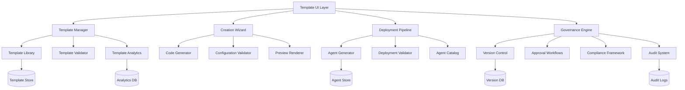

# Design Document

## Overview

The Rapid Prototyping & Template System transforms agent development from a manual, time-intensive process to a streamlined, template-driven workflow with enterprise-grade governance. The system provides a comprehensive template library, intelligent creation wizard, one-click deployment, version control, compliance framework, and advanced analytics that enable teams to create production-ready agents in minutes while maintaining security, compliance, and quality standards.

## Architecture

### High-Level Architecture



### Component Architecture

1. **Template Management Layer**
   - Template library with categorization and search
   - Template versioning and lifecycle management
   - Usage analytics and performance tracking
   - Template marketplace and sharing

2. **Creation Wizard Engine**
   - Multi-step wizard with intelligent validation
   - Real-time code preview and configuration
   - Dependency resolution and conflict detection
   - Advanced template features and customization

3. **Deployment Pipeline**
   - Automated agent package generation
   - One-click deployment with progress tracking
   - Integration with existing agent catalog
   - Rollback and recovery capabilities

4. **Governance Framework**
   - Version control with Git-like functionality
   - Approval workflows and role-based access
   - Policy enforcement and compliance checking
   - Comprehensive audit trail and change tracking

5. **Analytics & Monitoring**
   - Real-time agent health monitoring
   - Usage analytics and ROI tracking
   - Performance metrics and optimization
   - Executive dashboards and reporting

## Components and Interfaces

### 1. Template Library System

#### Template Model
```typescript
interface AgentTemplate {
  id: string;
  name: string;
  description: string;
  category: 'QE' | 'DevOps' | 'Security' | 'Business';
  version: string;
  author: string;
  createdAt: Date;
  updatedAt: Date;
  
  // Template Configuration
  complexity: 'Beginner' | 'Intermediate' | 'Advanced';
  estimatedSetupTime: number; // minutes
  tags: string[];
  
  // Technical Details
  technologies: string[];
  dependencies: TemplateDependency[];
  parameters: TemplateParameter[];
  
  // Content
  codeTemplate: string;
  configTemplate: object;
  documentation: string;
  sampleOutputs: SampleOutput[];
  
  // Governance
  approvalStatus: 'Draft' | 'Pending' | 'Approved' | 'Rejected';
  complianceStatus: 'Compliant' | 'Non-Compliant' | 'Under-Review';
  
  // Metadata
  usageCount: number;
  rating: number;
  lastUsed: Date;
  isActive: boolean;
}

interface TemplateParameter {
  name: string;
  type: 'string' | 'number' | 'boolean' | 'select' | 'multiselect' | 'file' | 'secret';
  description: string;
  defaultValue?: any;
  required: boolean;
  validation?: ValidationRule[];
  options?: ParameterOption[];
  conditional?: ConditionalLogic;
}
```

#### Template Library Interface
```typescript
interface TemplateLibraryService {
  getTemplates(filters?: TemplateFilters): Promise<AgentTemplate[]>;
  getTemplate(id: string): Promise<AgentTemplate>;
  searchTemplates(query: string): Promise<AgentTemplate[]>;
  getTemplatesByCategory(category: string): Promise<AgentTemplate[]>;
  getPopularTemplates(limit: number): Promise<AgentTemplate[]>;
  getTemplateAnalytics(id: string): Promise<TemplateAnalytics>;
  createTemplate(template: Partial<AgentTemplate>): Promise<AgentTemplate>;
  updateTemplate(id: string, updates: Partial<AgentTemplate>): Promise<AgentTemplate>;
  publishTemplate(id: string): Promise<PublishResult>;
}
```

### 2. Creation Wizard System

#### Wizard Configuration
```typescript
interface WizardStep {
  id: string;
  title: string;
  description: string;
  parameters: TemplateParameter[];
  validation: ValidationRule[];
  dependencies?: string[]; // Other step IDs
  conditionalDisplay?: ConditionalLogic;
}

interface WizardState {
  templateId: string;
  currentStep: number;
  steps: WizardStep[];
  values: Record<string, any>;
  errors: Record<string, string[]>;
  isValid: boolean;
  preview: CodePreview;
  complianceStatus: ComplianceCheck;
}
```

#### Code Generation Engine
```typescript
interface CodeGenerator {
  generateCode(template: AgentTemplate, parameters: Record<string, any>): Promise<GeneratedCode>;
  validateConfiguration(template: AgentTemplate, parameters: Record<string, any>): ValidationResult;
  previewCode(template: AgentTemplate, parameters: Record<string, any>): Promise<CodePreview>;
  resolveDependencies(template: AgentTemplate): Promise<DependencyResolution>;
  checkCompliance(generatedCode: GeneratedCode): Promise<ComplianceResult>;
}

interface GeneratedCode {
  files: GeneratedFile[];
  configuration: object;
  dependencies: string[];
  documentation: string;
  testCases: TestCase[];
  metadata: AgentMetadata;
}
```

### 3. Governance Framework

#### Version Control System
```typescript
interface VersionControlService {
  createVersion(agentId: string, changes: AgentChanges): Promise<AgentVersion>;
  getVersionHistory(agentId: string): Promise<AgentVersion[]>;
  compareVersions(agentId: string, version1: string, version2: string): Promise<VersionDiff>;
  rollbackToVersion(agentId: string, version: string): Promise<RollbackResult>;
  createBranch(agentId: string, branchName: string): Promise<Branch>;
  mergeBranch(agentId: string, sourceBranch: string, targetBranch: string): Promise<MergeResult>;
}

interface AgentVersion {
  version: string;
  agentId: string;
  changes: ChangeLog[];
  author: string;
  createdAt: Date;
  commitMessage: string;
  tags: string[];
  isActive: boolean;
  parentVersion?: string;
}
```

#### Approval Workflow System
```typescript
interface ApprovalWorkflowService {
  submitForApproval(agentId: string, approvalType: ApprovalType): Promise<ApprovalRequest>;
  getApprovalRequests(filters?: ApprovalFilters): Promise<ApprovalRequest[]>;
  approveRequest(requestId: string, comments?: string): Promise<ApprovalResult>;
  rejectRequest(requestId: string, reason: string): Promise<ApprovalResult>;
  getApprovalHistory(agentId: string): Promise<ApprovalHistory[]>;
}

interface ApprovalRequest {
  id: string;
  agentId: string;
  requestType: 'Creation' | 'Update' | 'Deployment' | 'Deletion';
  status: 'Pending' | 'Approved' | 'Rejected' | 'Cancelled';
  submittedBy: string;
  submittedAt: Date;
  reviewedBy?: string;
  reviewedAt?: Date;
  comments?: string;
  changes: AgentChanges;
  impactAnalysis: ImpactAnalysis;
}
```

### 4. Compliance Framework

#### Compliance Engine
```typescript
interface ComplianceEngine {
  scanAgent(agent: AgentPackage): Promise<ComplianceResult>;
  validatePolicies(agent: AgentPackage, policies: CompliancePolicy[]): Promise<PolicyValidationResult>;
  getCertificationStatus(agentId: string): Promise<CertificationStatus>;
  generateComplianceReport(agentId: string): Promise<ComplianceReport>;
  updateComplianceStatus(agentId: string, status: ComplianceStatus): Promise<void>;
}

interface CompliancePolicy {
  id: string;
  name: string;
  description: string;
  category: 'Security' | 'Quality' | 'Performance' | 'Legal';
  rules: ComplianceRule[];
  severity: 'Low' | 'Medium' | 'High' | 'Critical';
  isActive: boolean;
  applicableTemplates: string[];
}

interface ComplianceResult {
  agentId: string;
  overallStatus: 'Compliant' | 'Non-Compliant' | 'Warning';
  violations: ComplianceViolation[];
  score: number;
  lastChecked: Date;
  recommendations: string[];
}
```

### 5. Analytics & Monitoring System

#### Analytics Service
```typescript
interface AnalyticsService {
  getTemplateUsageStats(): Promise<TemplateUsageStats>;
  getAgentPerformanceMetrics(agentId: string): Promise<PerformanceMetrics>;
  calculateROI(timeframe: TimeRange): Promise<ROIMetrics>;
  getComplianceMetrics(): Promise<ComplianceMetrics>;
  generateExecutiveDashboard(): Promise<ExecutiveDashboard>;
  trackUserActivity(activity: UserActivity): Promise<void>;
}

interface ROIMetrics {
  timeSaved: number; // hours
  costReduction: number; // dollars
  productivityIncrease: number; // percentage
  agentsCreated: number;
  averageCreationTime: number; // minutes
  traditionalDevelopmentTime: number; // hours
  roi: number; // percentage
}

interface PerformanceMetrics {
  agentId: string;
  uptime: number;
  responseTime: number;
  errorRate: number;
  throughput: number;
  resourceUsage: ResourceUsage;
  healthStatus: 'Healthy' | 'Warning' | 'Critical' | 'Down';
}
```

## Data Models

### Template Categories and Professional Templates

#### QE Templates (Quality Engineering)
1. **Web UI Test Automation Pro** - Playwright, Selenium, Cypress
2. **API Test Automation Suite** - REST Assured, Postman, Karate
3. **Performance Testing Framework** - JMeter, K6, Artillery
4. **Mobile Test Automation** - Appium, Detox, XCUITest
5. **Database Testing Validator** - SQL validation, data integrity

#### DevOps Templates
1. **CI/CD Pipeline Builder** - Jenkins, GitHub Actions, Azure DevOps
2. **Infrastructure as Code** - Terraform, CloudFormation, Ansible
3. **Monitoring & Alerting** - Prometheus, Grafana, DataDog
4. **Container Orchestration** - Kubernetes, Docker Compose
5. **Security Scanning Pipeline** - SAST, DAST, dependency scanning

#### Security Templates
1. **Vulnerability Assessment** - OWASP ZAP, Nessus integration
2. **Compliance Checker** - SOC2, GDPR, HIPAA validation
3. **Penetration Testing** - Automated security testing
4. **Access Control Auditor** - Permission and role validation
5. **Security Monitoring** - SIEM integration, threat detection

#### Business Templates
1. **Data Analytics Pipeline** - ETL pipelines, reporting dashboards
2. **Process Automation** - Workflow automation, RPA
3. **Customer Analytics** - Behavior analysis, segmentation
4. **Financial Reporting** - Automated financial dashboards
5. **Compliance Reporting** - Regulatory reporting automation

### Template Metadata Schema

```json
{
  "template": {
    "id": "web-ui-automation-pro-v3",
    "name": "Web UI Test Automation Pro",
    "category": "QE",
    "complexity": "Intermediate",
    "estimatedSetupTime": 15,
    "technologies": ["Playwright", "TypeScript", "Jest", "Docker"],
    "governance": {
      "approvalRequired": true,
      "compliancePolicies": ["security-scan", "code-quality"],
      "rolePermissions": {
        "create": ["developer", "senior-developer"],
        "approve": ["tech-lead", "architect"],
        "deploy": ["devops", "admin"]
      }
    },
    "parameters": [
      {
        "name": "applicationUrl",
        "type": "string",
        "description": "Base URL of the application to test",
        "required": true,
        "validation": ["url"],
        "compliance": ["security-url-validation"]
      },
      {
        "name": "testFramework",
        "type": "select",
        "description": "Testing framework to use",
        "options": ["Playwright", "Selenium", "Cypress"],
        "defaultValue": "Playwright",
        "conditional": {
          "showIf": "complexity === 'Advanced'"
        }
      }
    ]
  }
}
```

## User Experience Flow

### Template Discovery & Selection Flow
1. **Browse Library** - User views categorized template library with governance badges
2. **Filter & Search** - User applies filters including compliance status and approval state
3. **Template Details** - User views template details, compliance status, and approval history
4. **Governance Check** - System validates user permissions before allowing template selection
5. **Select Template** - User chooses template and clicks "Create Agent" (if authorized)

### Agent Creation Flow with Governance
1. **Wizard Launch** - Multi-step wizard opens with governance context
2. **Parameter Configuration** - User fills parameters with real-time compliance checking
3. **Code Preview** - Real-time preview with compliance annotations
4. **Governance Validation** - System validates against policies and approval requirements
5. **Approval Workflow** - If required, agent enters approval workflow
6. **Review & Deploy** - After approval, user can deploy with full audit trail

### Deployment Flow with Monitoring
1. **Pre-Deployment Validation** - Comprehensive compliance and security scanning
2. **Package Generation** - System creates complete agent package with metadata
3. **Deployment Pipeline** - Automated deployment with real-time progress tracking
4. **Health Monitoring** - Immediate health checks and monitoring setup
5. **Registration** - Agent added to catalog with governance metadata
6. **Notification** - Stakeholders notified with deployment summary and compliance status

## Security Considerations

### Template Security
- **Code Scanning** - Automated security scanning of all template code
- **Dependency Validation** - Security scanning of all template dependencies
- **Access Control** - Role-based access to template creation and modification
- **Encryption** - All sensitive template data encrypted at rest and in transit

### Governance Security
- **Audit Logging** - Comprehensive logging of all governance activities
- **Access Control** - Fine-grained permissions for governance operations
- **Approval Integrity** - Digital signatures for approval workflows
- **Change Tracking** - Immutable audit trail of all changes

### Deployment Security
- **Secure Secrets** - Integration with enterprise secret management
- **Environment Isolation** - Secure deployment to isolated environments
- **Compliance Enforcement** - Automated blocking of non-compliant deployments
- **Incident Response** - Automated response to security incidents

## Performance Considerations

### Template Loading & Search
- **Lazy Loading** - Load template details on demand
- **Search Indexing** - Elasticsearch for fast template search
- **CDN Integration** - Serve template assets from CDN
- **Caching Strategy** - Multi-level caching for frequently accessed templates

### Code Generation & Preview
- **Streaming** - Stream generated code for large templates
- **Background Processing** - Generate code in background for complex templates
- **Caching** - Cache generated code for identical configurations
- **Resource Management** - Manage CPU and memory for code generation

### Governance & Compliance
- **Parallel Processing** - Run compliance checks in parallel
- **Incremental Scanning** - Only scan changed components
- **Background Jobs** - Process approval workflows asynchronously
- **Database Optimization** - Optimized queries for audit trail and version history

## Integration Architecture

### CI/CD Integration
```typescript
interface CICDIntegration {
  deployTemplate(templateId: string, environment: string, parameters: object): Promise<DeploymentResult>;
  getDeploymentStatus(deploymentId: string): Promise<DeploymentStatus>;
  rollbackDeployment(deploymentId: string): Promise<RollbackResult>;
  validateTemplate(templateId: string): Promise<ValidationResult>;
}
```

### Enterprise SSO Integration
```typescript
interface SSOIntegration {
  authenticateUser(token: string): Promise<User>;
  getUserPermissions(userId: string): Promise<Permission[]>;
  validateAccess(userId: string, resource: string, action: string): Promise<boolean>;
  getApprovalChain(userId: string, approvalType: string): Promise<ApprovalChain>;
}
```

### Monitoring Integration
```typescript
interface MonitoringIntegration {
  sendMetrics(metrics: Metric[]): Promise<void>;
  createAlert(alert: Alert): Promise<void>;
  getHealthStatus(agentId: string): Promise<HealthStatus>;
  trackPerformance(agentId: string, metrics: PerformanceData): Promise<void>;
}
```

This comprehensive design provides the foundation for building an enterprise-grade rapid prototyping and template system that will transform your platform into a true agent development factory with professional governance, compliance, and monitoring capabilities.