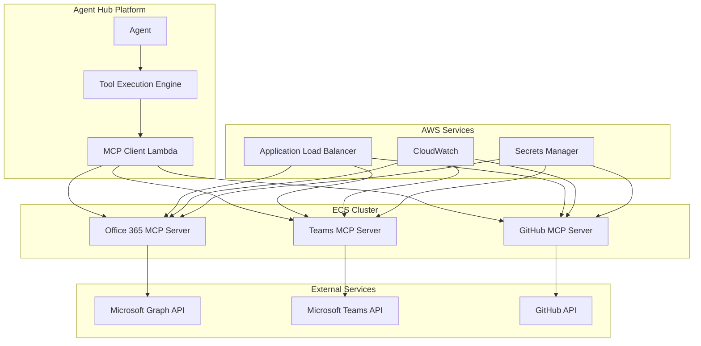

# Day 3 MCP Integration Design

## Overview

This design document outlines the technical architecture for implementing essential Model Context Protocol (MCP) integrations in the Agent Hub Platform. The solution provides enterprise-grade integrations with Office 365, Microsoft Teams, and GitHub through containerized MCP servers running on AWS ECS/Fargate.

## Architecture

### High-Level Architecture



### Component Architecture

#### 1. ECS/Fargate Infrastructure
- **ECS Cluster**: `agent-hub-mcp-cluster`
- **Launch Type**: Fargate for serverless container management
- **Networking**: VPC with private subnets and NAT Gateway
- **Load Balancer**: Application Load Balancer for health checks and routing
- **Auto Scaling**: Target tracking based on CPU and memory utilization

#### 2. MCP Server Design Pattern
Each MCP server follows a consistent design pattern:
- **Base Image**: Node.js 18 Alpine for minimal footprint
- **Protocol**: MCP over HTTP with JSON-RPC 2.0
- **Authentication**: OAuth 2.0 with token refresh handling
- **Logging**: Structured JSON logging to CloudWatch
- **Health Checks**: `/health` endpoint for load balancer monitoring
- **Metrics**: Prometheus-compatible metrics on `/metrics` endpoint

## Components and Interfaces

### 1. Tool Execution Engine (Lambda)

**Purpose**: Central orchestrator for all MCP tool requests

**Interface**:
```typescript
interface ToolExecutionRequest {
  agentId: string;
  toolName: string;
  parameters: Record<string, any>;
  timeout?: number;
  priority?: 'low' | 'normal' | 'high';
}

interface ToolExecutionResponse {
  executionId: string;
  status: 'pending' | 'running' | 'completed' | 'failed';
  result?: any;
  error?: string;
  executionTime: number;
}
```

**Key Features**:
- Request validation and sanitization
- Server discovery and load balancing
- Execution tracking and status updates
- Timeout and retry handling
- Audit logging

### 2. MCP Client (Lambda)

**Purpose**: Protocol adapter between Agent Hub and MCP servers

**Interface**:
```typescript
interface MCPClientConfig {
  serverUrl: string;
  timeout: number;
  retryAttempts: number;
  connectionPool: {
    maxConnections: number;
    keepAlive: boolean;
  };
}

interface MCPRequest {
  method: string;
  params: Record<string, any>;
  id: string;
}
```

**Key Features**:
- Connection pooling and management
- Request/response caching
- Health monitoring
- Graceful degradation

### 3. Office 365 MCP Server

**Purpose**: Microsoft Office integration capabilities

**Supported Tools**:
- `excel_create_workbook`: Create new Excel workbooks
- `excel_read_data`: Read data from Excel sheets
- `excel_write_data`: Write data to Excel sheets
- `word_create_document`: Create Word documents
- `word_insert_content`: Insert content into documents
- `sharepoint_upload`: Upload files to SharePoint
- `sharepoint_download`: Download files from SharePoint

**Authentication**: Microsoft Graph API with OAuth 2.0
**Scopes**: `Files.ReadWrite`, `Sites.ReadWrite.All`

### 4. Microsoft Teams MCP Server

**Purpose**: Teams collaboration and communication

**Supported Tools**:
- `teams_send_message`: Send messages to channels or users
- `teams_create_channel`: Create new Teams channels
- `teams_upload_file`: Upload files to Teams
- `teams_schedule_meeting`: Schedule Teams meetings
- `teams_get_members`: Get channel or team members
- `teams_create_team`: Create new Teams

**Authentication**: Microsoft Graph API with OAuth 2.0
**Scopes**: `Chat.ReadWrite`, `Channel.ReadWrite.All`, `Team.Create`

### 5. GitHub MCP Server

**Purpose**: GitHub repository and project management

**Supported Tools**:
- `github_create_repo`: Create new repositories
- `github_create_issue`: Create GitHub issues
- `github_create_pr`: Create pull requests
- `github_merge_pr`: Merge pull requests
- `github_get_commits`: Get commit history
- `github_create_branch`: Create new branches
- `github_upload_file`: Upload files to repositories

**Authentication**: GitHub Personal Access Token or GitHub App
**Permissions**: `repo`, `issues`, `pull_requests`

## Data Models

### MCP Server Configuration
```typescript
interface MCPServerConfig {
  name: string;
  image: string;
  port: number;
  environment: {
    [key: string]: string;
  };
  secrets: {
    [key: string]: string; // References to AWS Secrets Manager
  };
  resources: {
    cpu: number;
    memory: number;
  };
  scaling: {
    minCapacity: number;
    maxCapacity: number;
    targetCPU: number;
    targetMemory: number;
  };
}
```

### Tool Execution Record
```typescript
interface ToolExecution {
  executionId: string;
  agentId: string;
  toolName: string;
  serverName: string;
  parameters: Record<string, any>;
  status: ExecutionStatus;
  startTime: string;
  endTime?: string;
  result?: any;
  error?: string;
  metrics: {
    executionTime: number;
    serverResponseTime: number;
    retryCount: number;
  };
}
```

## Error Handling

### Error Categories
1. **Authentication Errors**: OAuth token expiry, invalid credentials
2. **Network Errors**: Server unavailable, timeout, connection refused
3. **Validation Errors**: Invalid parameters, missing required fields
4. **Rate Limiting**: API quota exceeded, throttling
5. **Server Errors**: Internal server errors, service unavailable

### Error Response Format
```typescript
interface MCPError {
  code: string;
  message: string;
  details?: Record<string, any>;
  retryable: boolean;
  retryAfter?: number;
}
```

### Retry Strategy
- **Exponential Backoff**: 1s, 2s, 4s, 8s intervals
- **Max Retries**: 3 attempts for retryable errors
- **Circuit Breaker**: Fail fast after 5 consecutive failures
- **Jitter**: Random delay to prevent thundering herd

## Testing Strategy

### Unit Testing
- **MCP Server Logic**: Tool implementations and business logic
- **Authentication**: OAuth flow and token management
- **Error Handling**: All error scenarios and edge cases
- **Data Validation**: Input sanitization and validation

### Integration Testing
- **End-to-End Workflows**: Complete agent-to-external-service flows
- **Authentication Integration**: Real OAuth flows with test accounts
- **API Integration**: Actual calls to Microsoft Graph and GitHub APIs
- **Load Testing**: Performance under concurrent requests

### Test Environment Setup
```yaml
# docker-compose.test.yml
version: '3.8'
services:
  office365-mcp:
    build: ./servers/office365
    environment:
      - NODE_ENV=test
      - GRAPH_API_URL=https://graph.microsoft.com/v1.0
    ports:
      - "3001:3000"
  
  teams-mcp:
    build: ./servers/teams
    environment:
      - NODE_ENV=test
    ports:
      - "3002:3000"
  
  github-mcp:
    build: ./servers/github
    environment:
      - NODE_ENV=test
      - GITHUB_API_URL=https://api.github.com
    ports:
      - "3003:3000"
```

### Performance Testing
- **Load Testing**: 100 concurrent requests per server
- **Stress Testing**: Gradual load increase to failure point
- **Endurance Testing**: Sustained load over 1 hour
- **Spike Testing**: Sudden load increases

## Security Considerations

### Authentication and Authorization
- **OAuth 2.0**: All external service authentication
- **Token Storage**: AWS Secrets Manager for secure token storage
- **Token Rotation**: Automatic refresh token handling
- **Least Privilege**: Minimal required scopes and permissions

### Network Security
- **VPC Isolation**: Private subnets for MCP servers
- **Security Groups**: Restrictive inbound/outbound rules
- **TLS Encryption**: All communication encrypted in transit
- **WAF Protection**: Web Application Firewall for public endpoints

### Data Protection
- **Input Sanitization**: All user inputs validated and sanitized
- **Output Filtering**: Sensitive data removed from responses
- **Audit Logging**: All operations logged for compliance
- **Data Encryption**: Sensitive data encrypted at rest

## Deployment Strategy

### Infrastructure as Code
```typescript
// CDK Stack for MCP Infrastructure
export class MCPInfrastructureStack extends Stack {
  constructor(scope: Construct, id: string, props?: StackProps) {
    super(scope, id, props);

    // ECS Cluster
    const cluster = new ecs.Cluster(this, 'MCPCluster', {
      clusterName: 'agent-hub-mcp-cluster',
      containerInsights: true
    });

    // Application Load Balancer
    const alb = new elbv2.ApplicationLoadBalancer(this, 'MCPALB', {
      vpc: cluster.vpc,
      internetFacing: false
    });

    // MCP Services
    this.createMCPService(cluster, alb, 'office365', 3001);
    this.createMCPService(cluster, alb, 'teams', 3002);
    this.createMCPService(cluster, alb, 'github', 3003);
  }
}
```

### Container Deployment
- **Blue-Green Deployment**: Zero-downtime deployments
- **Health Check Grace Period**: 60 seconds for service startup
- **Rolling Updates**: Gradual replacement of containers
- **Rollback Strategy**: Automatic rollback on health check failures

### Monitoring and Alerting
- **CloudWatch Metrics**: CPU, memory, request count, error rate
- **Custom Metrics**: Tool execution time, success rate, queue depth
- **Alarms**: High error rate, high latency, service unavailable
- **Dashboards**: Real-time operational visibility

## Cost Optimization

### Resource Optimization
- **Fargate Spot**: Use Spot instances for non-critical workloads
- **Auto Scaling**: Scale down during low usage periods
- **Connection Pooling**: Reduce connection overhead
- **Response Caching**: Cache frequently requested data

### Estimated Costs (Daily)
- **ECS Fargate**: $2-4/day (3 services, minimal resources)
- **Application Load Balancer**: $0.60/day
- **CloudWatch Logs**: $0.10-0.50/day
- **Secrets Manager**: $0.12/day
- **Total**: $2.82-5.22/day

### Cost Monitoring
- **AWS Cost Explorer**: Daily cost tracking
- **Budget Alerts**: Notifications when costs exceed thresholds
- **Resource Tagging**: Detailed cost attribution
- **Usage Analytics**: Identify optimization opportunities