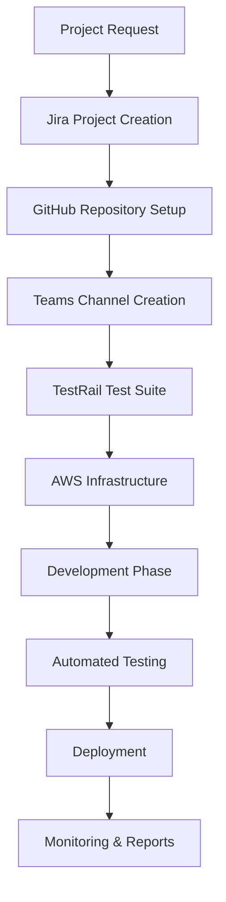
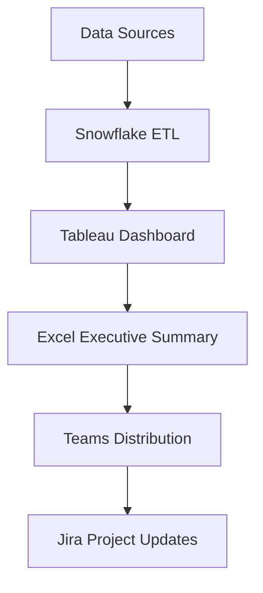
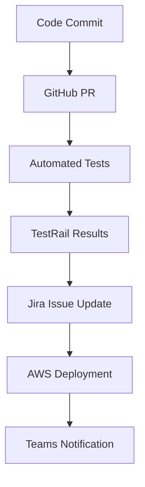

# Enterprise Agent Catalog - Business Automation Platform

## 🏢 **Enterprise Agent Categories**

### **1. Office Productivity Agents**

#### **📊 Excel Analytics Agent**
- **Description**: Automates Excel report generation and data analysis
- **MCP Tools**: `office.excel.*`, `analytics.snowflake.*`
- **Use Cases**:
  - Generate monthly financial reports
  - Create pivot tables from database queries
  - Automate chart generation for presentations
  - Consolidate data from multiple sources

#### **📝 Document Automation Agent**
- **Description**: Creates and manages Word documents from templates
- **MCP Tools**: `office.word.*`, `teams.share_file`
- **Use Cases**:
  - Generate contracts from templates
  - Create project documentation
  - Merge multiple documents
  - Convert documents to PDF

#### **🎯 Presentation Builder Agent**
- **Description**: Creates PowerPoint presentations with data visualizations
- **MCP Tools**: `office.powerpoint.*`, `tableau.create_dashboard`
- **Use Cases**:
  - Generate executive dashboards
  - Create project status presentations
  - Build training materials
  - Automate quarterly reviews

### **2. Project Management Agents**

#### **📋 Jira Automation Agent**
- **Description**: Manages Jira projects, issues, and workflows
- **MCP Tools**: `jira.*`, `teams.send_notification`
- **Use Cases**:
  - Create projects with standard templates
  - Bulk update issue statuses
  - Generate sprint reports
  - Automate issue assignments

#### **🧪 Test Management Agent**
- **Description**: Manages TestRail test cases and execution
- **MCP Tools**: `testrail.*`, `github.create_issue`
- **Use Cases**:
  - Create test cases from requirements
  - Execute automated test runs
  - Generate test coverage reports
  - Link defects to GitHub issues

#### **📈 Project Analytics Agent**
- **Description**: Analyzes project metrics across platforms
- **MCP Tools**: `jira.search_issues`, `github.analyze_commits`, `testrail.generate_report`
- **Use Cases**:
  - Track project velocity
  - Analyze code quality metrics
  - Monitor test coverage trends
  - Generate executive summaries

### **3. DevOps & Development Agents**

#### **🔄 CI/CD Orchestration Agent**
- **Description**: Manages complete CI/CD pipeline across platforms
- **MCP Tools**: `github.*`, `aws.deploy_application`, `teams.notify_deployment`
- **Use Cases**:
  - Automate code deployment
  - Manage release branches
  - Coordinate multi-environment deployments
  - Handle rollback procedures

#### **🔍 Code Quality Agent**
- **Description**: Monitors and improves code quality across repositories
- **MCP Tools**: `github.analyze_code`, `jira.create_issue`, `teams.send_alert`
- **Use Cases**:
  - Perform automated code reviews
  - Track technical debt
  - Enforce coding standards
  - Generate quality reports

#### **☁️ Infrastructure Management Agent**
- **Description**: Manages cloud infrastructure across AWS, Azure, GCP
- **MCP Tools**: `aws.*`, `azure.*`, `gcp.*`
- **Use Cases**:
  - Provision infrastructure resources
  - Monitor resource utilization
  - Optimize costs
  - Manage security policies

### **4. Analytics & Business Intelligence Agents**

#### **📊 Data Pipeline Agent**
- **Description**: Manages data pipelines and ETL processes
- **MCP Tools**: `snowflake.*`, `aws.s3.*`, `tableau.refresh_data`
- **Use Cases**:
  - Extract data from multiple sources
  - Transform and load data to warehouse
  - Schedule data refreshes
  - Monitor pipeline health

#### **📈 Business Intelligence Agent**
- **Description**: Creates comprehensive business reports and dashboards
- **MCP Tools**: `snowflake.execute_query`, `tableau.create_dashboard`, `office.excel.*`
- **Use Cases**:
  - Generate executive dashboards
  - Create financial reports
  - Analyze customer metrics
  - Track KPI performance

#### **🎯 Performance Analytics Agent**
- **Description**: Analyzes application and business performance
- **MCP Tools**: `aws.cloudwatch.*`, `snowflake.*`, `teams.send_report`
- **Use Cases**:
  - Monitor application performance
  - Analyze user behavior
  - Track business metrics
  - Generate performance alerts

### **5. Communication & Collaboration Agents**

#### **💬 Teams Automation Agent**
- **Description**: Automates Microsoft Teams communication and collaboration
- **MCP Tools**: `teams.*`, `office.outlook.*`
- **Use Cases**:
  - Schedule automated meetings
  - Send project updates
  - Manage team channels
  - Share files and documents

#### **📢 Notification Hub Agent**
- **Description**: Manages notifications across all communication platforms
- **MCP Tools**: `teams.send_message`, `office.outlook.send_email`, `jira.add_comment`
- **Use Cases**:
  - Send multi-channel alerts
  - Escalate critical issues
  - Distribute reports
  - Coordinate team communications

#### **🤝 Collaboration Sync Agent**
- **Description**: Synchronizes work across different collaboration platforms
- **MCP Tools**: `teams.*`, `jira.*`, `github.*`
- **Use Cases**:
  - Sync Jira issues with Teams discussions
  - Link GitHub PRs to Teams channels
  - Update project status across platforms
  - Coordinate cross-team work

### **6. Security & Compliance Agents**

#### **🔒 Security Monitoring Agent**
- **Description**: Monitors security across all enterprise platforms
- **MCP Tools**: `aws.iam.*`, `github.security_scan`, `jira.create_security_issue`
- **Use Cases**:
  - Scan for security vulnerabilities
  - Monitor access permissions
  - Generate compliance reports
  - Automate security responses

#### **📋 Compliance Reporting Agent**
- **Description**: Generates compliance reports across all systems
- **MCP Tools**: `jira.audit_trail`, `github.access_logs`, `aws.compliance_check`
- **Use Cases**:
  - Generate SOX compliance reports
  - Track GDPR compliance
  - Monitor access controls
  - Audit system changes

### **7. Customer & Sales Agents**

#### **📞 Customer Support Agent**
- **Description**: Manages customer support workflows
- **MCP Tools**: `jira.service_desk`, `teams.customer_channel`, `office.outlook.*`
- **Use Cases**:
  - Create support tickets
  - Escalate critical issues
  - Generate customer reports
  - Track resolution times

#### **💰 Sales Analytics Agent**
- **Description**: Analyzes sales performance and forecasting
- **MCP Tools**: `snowflake.sales_data`, `tableau.sales_dashboard`, `office.excel.*`
- **Use Cases**:
  - Generate sales reports
  - Track pipeline metrics
  - Forecast revenue
  - Analyze customer trends

## 🔄 **Cross-Platform Workflow Examples**

### **End-to-End Project Delivery Workflow**

### **Business Intelligence Workflow**

### **DevOps Automation Workflow**

## 🎯 **Agent Templates for Enterprise**

### **Department-Specific Templates**

#### **IT Department Template**
- Infrastructure Management Agent
- Security Monitoring Agent
- DevOps Automation Agent
- Performance Analytics Agent

#### **Finance Department Template**
- Financial Reporting Agent
- Budget Analytics Agent
- Compliance Reporting Agent
- Excel Automation Agent

#### **HR Department Template**
- Employee Onboarding Agent
- Performance Review Agent
- Training Coordination Agent
- Communication Hub Agent

#### **Sales Department Template**
- Sales Analytics Agent
- Customer Support Agent
- Lead Management Agent
- Revenue Forecasting Agent

#### **Marketing Department Template**
- Campaign Analytics Agent
- Content Management Agent
- Social Media Automation Agent
- Performance Tracking Agent

## 📊 **Enterprise Agent Metrics**

### **Productivity Metrics**
- **Time Saved**: Hours automated per week
- **Error Reduction**: % decrease in manual errors
- **Process Efficiency**: % improvement in workflow speed
- **Cost Savings**: $ saved through automation

### **Business Impact Metrics**
- **Project Delivery**: % improvement in on-time delivery
- **Quality Metrics**: % reduction in defects
- **Customer Satisfaction**: NPS score improvement
- **Revenue Impact**: $ revenue attributed to automation

### **Technical Metrics**
- **System Uptime**: % availability of agent services
- **Response Time**: Average agent execution time
- **Success Rate**: % of successful agent executions
- **Integration Health**: % uptime of MCP connections

## 🚀 **Implementation Strategy**

### **Phase 1: Core Business Functions (Weeks 1-4)**
- Office Productivity Agents
- Basic Project Management
- Communication Automation

### **Phase 2: Development & DevOps (Weeks 5-8)**
- CI/CD Orchestration
- Code Quality Management
- Infrastructure Automation

### **Phase 3: Analytics & Intelligence (Weeks 9-12)**
- Business Intelligence Agents
- Data Pipeline Management
- Performance Analytics

### **Phase 4: Advanced Enterprise (Weeks 13-16)**
- Security & Compliance
- Cross-platform Workflows
- Custom Department Solutions

This enterprise agent catalog transforms your platform into a **comprehensive business automation solution** that can handle workflows across all major enterprise functions!